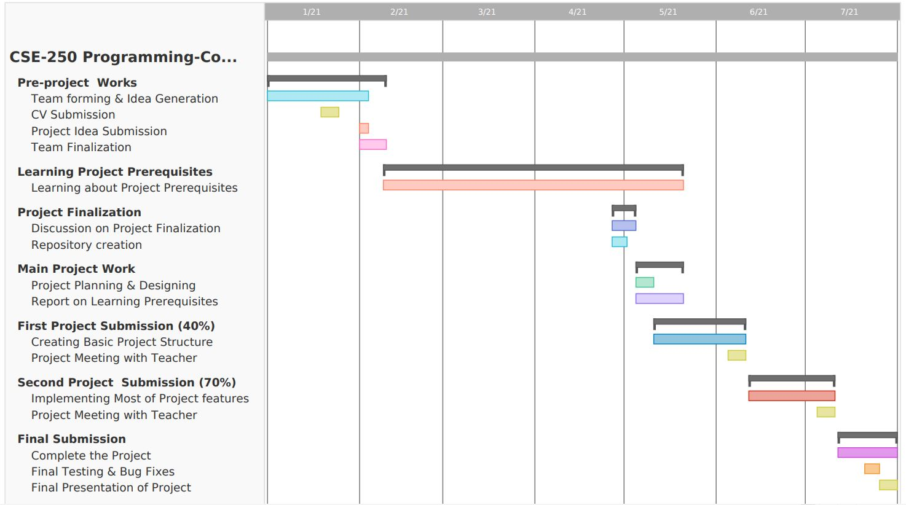

# G15- SUST Programming Community

## Motivation behind the project
As we know, the newcomers always feel at a lost after coming into CSE department regarding programming. They usually do not know how to start coding and what to do concerning that. So they need help from the someone who has walked through the same path. But some students hesitate to ask for help or don't know whom to ask or where to go. Moreover, the students from other departments go through the same issue as they have non-major courses of CSE.  This SUST Programming Community will help them. Our target is not just for the newcomers only but for every students. Every students need help at some point. And each one of us is expertise at different stuffs. We never know from whom we can get a little advice that can make a big difference in our knowledge. 

## Used Technologies
**Backend:** Django web framework

**Frontend:** Html, Css, Bootstrap

**Database:** Postgres

## Feature Description
**UI/UX:** Designed UI with responsiveness; equally usable to any devices like desktop, tab, mobile.

**Creating Posts:** 
* Users create posts about any enquiries regarding programming, seek help for problem solving. They will be able to provide code snippets. Special arrangements will be made for good readability. 
* Any users can help the student who has created a post by commenting on the post. 
* Users can provide tutorials after any programming contest.
* Users can edit and delete their posts.

**Notifications:** Users will be notified in case anyone posts something. The author of the post will be notified when someone comments in his post. The unread notifications can be easily distinguished from the read ones by color. There is button known as **mark all read** by which all the unread notifications can be made read at once.

**Resources:** Anyone can upload any type of files (jpg, png, pptx, pdf, txt and so on) and download it. The uploader can delete his resources whenever he wants.

**Contests:** Programming contest list of codeforces will be there in the contest section with all details.

**Searching:** Posts and resources can be searched very easily.

**Pagination:** When the number of post increases, the former post will go the next page. Lastest post first. One can simply navigate to the next page through this buttons. 

**Sending Mail:** Users can directly contact the developers for reporting any issues or suggesting new features for the application. The procedure is very simple. Just one need to write a subject and the message one needs to share and press the send button. The mail will be sent.

**Edit:** In profile section a user can edit his profile. He can change his profile picture. The list of his posts are also available there. He can edit and delete post from there.

**Information:** There is a Our Community section from where users can know all about the programming community. There are 3 sub sections there: Teacher's List - list of all the teachers there in the community, Student's List - list of all the students of the community and About - all about the community.

**Management/Control:** Teachers will be able to delete any posts or resources if those don't seem convenient or relevant.  

## Expected Timeline

## Report on Learning Pre-requisites

SL | Learning Task | Description | Status | Comment |
:-:|:-------------:|:------------|:------:|---------|
1| Web Basics | How websites work, front-end vs back-end, and using a code editor | ||
2| Frontend | Html, CSS |     | |
3| Frontend Framework | Bootstrap |  | |
4| Backend | Django - Python web framework |  | |
5| Virtual Environment | Setting up virtualenv for web development, starting a Django project using the command line, and run the website in localhost | | |
6| Django App and Models | Learning about Django app, creating Model, migrating the changes to databases |     | | 
7| Django Views and Templates |  Learning about Django views, using the HTML CSS frontend files in Django templates, learning the inheritance in templates, sending and receiving data between views and templates |     | |
8| Django Routing and Admin-panel | Learning about setting up URLs, generating slugs, using slugs to navigate pages, setting up admin panel, customizing the admin panel, ensuring proper security measures for admin panel |     | |

## Contributions
| Tanhab Hossain      | Ananna Dristy |
| ----------- | ----------- |
|1. Verification |1.Post|
|2. Accounts | 2. Resources |
|3. Notification | 3. User Profile |
|4. Comments | 4. Community |
|5. Contest | 5. Help and Support |

Apart from these, there are more minute detailings in features; frontend, backbend, database - works, bug fixes, improvements which are done by both of us. 

## Unimplemented Features
* Tags in resources
* Compiler for compiling codes 
## Acknowledgement
Thanks to -
*  Mitch for his playlist called **Building a Website with Django & Python** which helped a lot in building our basics on django.
*  Countless helpful people from Stackoverflow 

## Developers

**Group Number** : 15

**Group Name** : Drishub

**Group Members** :

| Name      | Registration No | Email Address | Cell No |
| ----------- | ----------- | ----------- | ----------- |
| Ananna Datta Dristy      | 2018331049       | anannadristy03@gmail.com | 01706364525
| Tanhab Hossain   | 2018331051   | tanhab3006@gmail.com | 01886593006 |

<small>&copy; 2021 - Dept. of CSE, SUST, BD</small>

